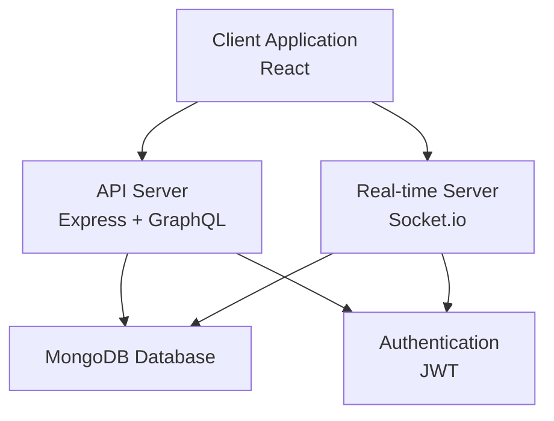

# DevConnect System Architecture

## Overview
DevConnect is a collaborative development platform designed for small-scale use (under 100 users, low concurrency). The system enables developers to work on projects, track issues, manage repositories, and communicate in real-time through chat and code editing features.

## Technology Stack

### Backend
- **Runtime**: Node.js (v18+)
- **Framework**: Express.js
- **API**: GraphQL (Apollo Server)
- **Database**: MongoDB (with Mongoose ODM)
- **Real-time Communication**: Socket.io
- **Authentication**: JWT (JSON Web Tokens)
- **Password Hashing**: bcrypt

### Frontend
- **Framework**: React (v18+)
- **State Management**: Redux Toolkit or Context API
- **Routing**: React Router
- **UI Library**: Material-UI or Tailwind CSS
- **Real-time Client**: Socket.io-client

### Development Tools
- **Version Control**: Git
- **Package Manager**: npm or yarn
- **Testing**: Jest, React Testing Library
- **Linting**: ESLint
- **Code Formatting**: Prettier

## High-Level Architecture

### System Components
1. **Client Application** (React SPA)
   - User interface for all features
   - Handles real-time connections via Socket.io
   - Manages application state

2. **API Server** (Node.js/Express + GraphQL)
   - Handles HTTP requests and GraphQL queries/mutations
   - Manages authentication and authorization
   - Serves static files in production

3. **Real-time Server** (Socket.io)
   - Manages WebSocket connections
   - Handles real-time messaging, code editing, and notifications
   - Integrated with the API server for small-scale deployment

4. **Database** (MongoDB)
   - Stores all application data
   - Uses Mongoose for schema validation and data modeling

### Architecture Diagram

### Data Flow
1. User interacts with React frontend
2. Frontend makes GraphQL requests to API server for data operations
3. API server validates requests, interacts with MongoDB
4. Real-time features use Socket.io for bidirectional communication
5. Authentication tokens are validated on each request

### Deployment Architecture (Small-scale)
- **Development**: Local MongoDB instance, single Node.js server
- **Production**: Single server deployment with MongoDB Atlas or local MongoDB
- **Hosting**: Heroku, DigitalOcean, or similar PaaS provider

### Security Considerations
- JWT-based authentication with refresh tokens
- Password hashing with bcrypt
- Input validation and sanitization
- CORS configuration
- Rate limiting for API endpoints

### Scalability Notes
For small-scale deployment, a monolithic architecture is sufficient. If user base grows, consider:
- Separating real-time server from API server
- Implementing database sharding
- Adding Redis for session management and caching
- Using a reverse proxy (nginx) for load balancing

## Key Features Mapping to Architecture

- **Authentication & User Management**: Handled by API server with JWT
- **Project Management**: GraphQL API with MongoDB storage
- **Issue Tracking**: GraphQL mutations and queries
- **Real-time Messaging**: Socket.io rooms and events
- **Code Editing**: Socket.io for collaborative editing with operational transforms
- **Repository Management**: Integration with Git (external) and metadata storage in MongoDB
- **Project Boards**: Frontend component with drag-and-drop, data persisted via GraphQL

This architecture provides a solid foundation for the DevConnect platform while remaining simple enough for small-scale deployment and maintenance.